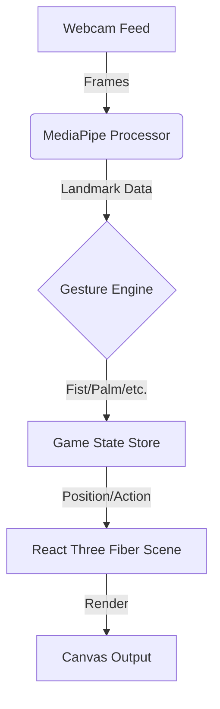

# 🎮 Gesture Racer - AI-Powered Hand Tracking Game


> **"Minority Report meets Wipeout"** - Experience the future of gaming with zero learning curve. Just raise your hand and fly.

[](https://react.dev/)
[](https://docs.pmndrs.assets/react-three-fiber/getting-started/introduction)
[](https://developers.google.com/mediapipe)
[](https://vitejs.dev/)

---

## 🌟 Why Gesture Racer?

Gesture Racer isn't just a game; it's a tech demo of what's possible in the browser. Using **Google MediaPipe** for millisecond-latency hand tracking and **React Three Fiber** for high-performance 3D graphics, we've built a seamless experience that runs on any modern laptop.

### ✨ Key Features

- **🤲 Zero-Touch Interface**: Your webcam is the controller. No mouse, no keyboard, no install.
- **🚀 3D Cyberpunk World**: Fly through neon-drenched cities and infinite procedurally generated tracks.
- **⚡ 60 FPS Performance**: Optimized for smooth gameplay even on mid-range devices.
- **🛡️ Dynamic Combat**: Fight AI drones with lasers, shields, and special abilities triggered by hand signs.

---

## 🕹️ Controls (Gestures)

We use advanced gesture recognition to map your hand movements to game actions instantly.

| Gesture | Action | Icon |
|:---:|:---|:---:|
| **Open Palm** | **Steer** your ship (Move hand L/R/U/D) | ✋ |
| **Fist** | **Fire** basic lasers | ✊ |
| **Peace Sign** | **Multi-Shot** / Special Attack | ✌️ |
| **Thumbs Up** | **Heal** / Activate Shield | 👍 |
| **Pinch** | **Precision Aim** / Zoom | 👌 |

---

## 🚀 Quick Start

### Prerequisites
- A computer with a **Webcam**.
- **Node.js** (v16+) installed.

### Installation

```bash
# Clone the repository
git clone https://github.com/vishva2410/Gesture_game-beta.git

# Navigate to project
cd Gesture_game-beta

# Install dependencies
npm install

# Start the game
npm run dev
```

Open `http://localhost:5173` in your browser (Chrome recommended for best performance).

---

## 📸 Screenshots

| High-Octane Action | Boss Battles |
|:---:|:---:|
|  |  |

| Calibration Mode | Selection Menu |
|:---:|:---:|
|  |  |

---

## 🛠️ Under the Hood

- **Core**: React 18, Vite
- **3D Engine**: Three.js, React Three Fiber (R3F)
- **Physics**: Rapier / Custom simple physics
- **AI/CV**: MediaPipe Hands (Google)
- **State**: Zustand

### Architecture
The game loop runs independent of React renders for maximum FPS. MediaPipe runs on a dedicated worker path where possible.



---

## 🤝 Contributing

We love open source!
1. Fork the repo.
2. Create your feature branch: `git checkout -b feature/CoolFeature`
3. Commit changes: `git commit -m 'Add CoolFeature'`
4. Push to branch: `git push origin feature/CoolFeature`
5. Submit a Pull Request.

---

## 📜 License

Distributed under the MIT License. See `LICENSE` for more information.

---

<div align="center">
  <sub>Built with ❤️ by Vishva Teja Guduguntla</sub>
</div>
